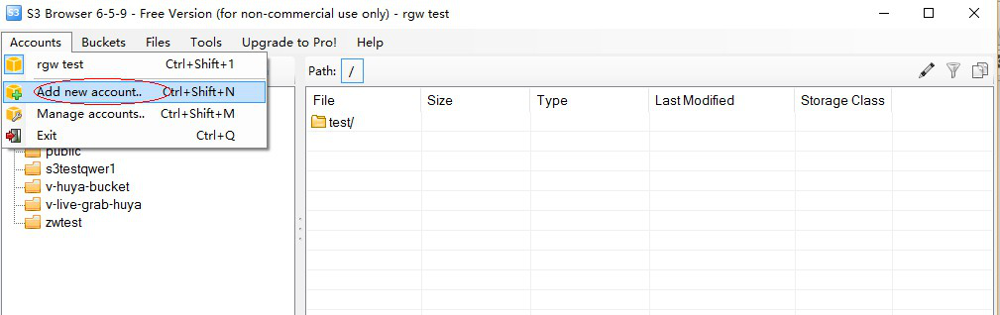
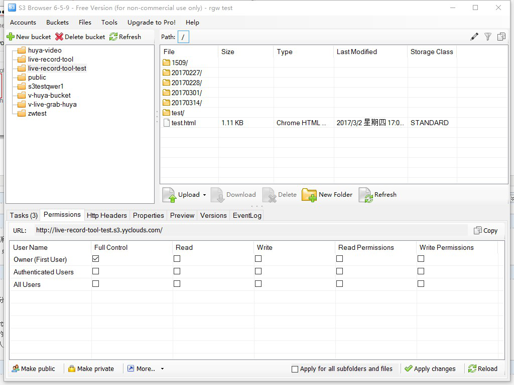

# 适用小白用户的 AWS S3 上传下载工具 - 配置与使用指南(AWS中国区测试可用)

S3存储是AWS最常用的云服务之一，S3没有容量限制，支持各种API，使用非常方便。在中国使用S3会有一点挑战，上传或下载文件
-- 通过AWS
Console（管理界面）经常会hang住（众所周知原因），导致S3用起来感觉很慢。

最常见的解决办法是用AWS
CLI命令行上传下载文件，不过敲命令这事儿对于小白用户来说还是比较难滴。

下面分别介绍两个免费免费软件，通过图形界面快速上传或下载文件到AWS
S3（(AWS中国区测试可用)

> -   MacOS：cyberduck

> -   Windows： S3 Browser

## [**S3 cyberduck配置指南**]

**cyberduck**相对于s3命令行来讲，是一个很方便的操作S3的图形化界面工具，用于MAC平台。
以下是配置步骤：

先下载，网址：<https://cyberduck.io/download/>

<s> <https://activate-camp-web-install-shandong.s3.cn-north-1.amazonaws.com.cn/Cyberduck-7.0.2.30998.zip> </s>

**[中国区配置教程如下：]**

**1）下载中国区S3的配置文件：**<https://cyberduck.io/s3/>
，根据您的需要选择北京或宁夏。

<s><https://activate-camp-web-install-shandong.s3.cn-north-1.amazonaws.com.cn/S3+China+(Ningxia).cyberduckprofile> </s>

**2）打开Cyberduck.app后，点击并运行配置文件"S3 China
(Ningxia).cyberduckprofile"**

**3）界面配置填写： Access Key ID 和 Secret Access Key**

** 4）Access Key ID 和 Secret Access Key来自AWS账号：**

**5）配置OK后，可以上传下载文件了：**

 点击进入目录，鼠标拖拽可以直接上传文件。

 

**6）测试上传，百兆- 千兆的文件都可以正常上传下载。**

**7）进阶教程：采用多线程加速。**

## [**S3 Browser 配置指南**]

S3 Browser 相对于s3命令行是一个很方便的操作S3的图形化界面工具。
以下是配置步骤：

下载网址：<http://s3browser.com/>

**[配置教程如下：]**

**1）新建用户**

**2）界面配置注意选择几点： AccountType: Amazon S3 in China  **

** 3）Access Key ID 和 Secret Access Key来自AWS账号：**

**4）配置OK后，可以上传下载文件了：**

 

 
